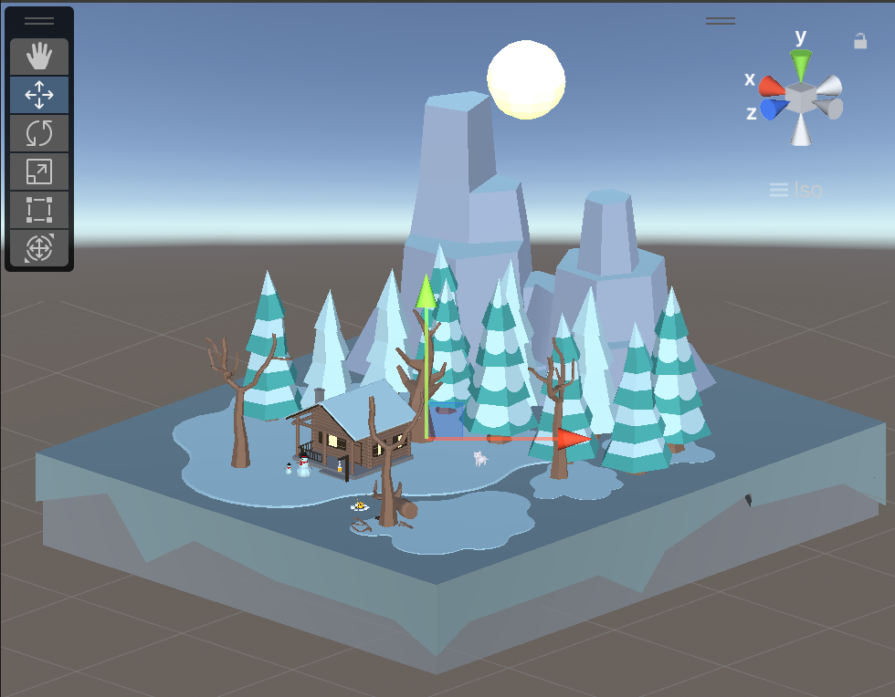

include::header.adoc[]
//override default to include table css
:stylesheet: front.css
:leveloffset: -1

:course: CMSC 283
:title: Game Programming
:term: Fall 2024

= {course}: {title} 

Term: {term}

Instructor: link:https://www.cs.brynmawr.edu/~alinen[Aline Normoyle]

[.anns]

* Next assignment is Due Sept 20th. link:assts/asst03.html[Assignment 03: Create a virtual world]
* Lab: Creating a simple scene (Details are in slack) 

== Course Info

**Welcome to CS283: Game Programming**! 

This intermediate programming course covers the foundational concepts,
architectures, and mathematics underlying video games and digital interactive
experiences. We will deconstruct the designs of classic games, such as Pac-Man,
Super Mario Brothers, Minecraft, Doom, and Diablo II, to explore the data
structures, algorithms, and foundational mathematics necessary to implement
popular game mechanics and features. Potential topics will include rendering and
modeling, navigation systems, game artificial intelligence, dialog systems,
character animation, networked multiplayer, user interfaces, physics engines,
and sound. The course will challenge students to create original and novel game
concepts through weekly assignments, labs, and a final project. Through these
projects, students will learn the foundational mathematics behind "making
objects move", such as transformations, splines, collision detection, and
raycasting. Furthermore, students will gain object-oriented programming
experience through designing mid-scale programs. Programming and project
assignments will be in C#, use the Processing and Unity frameworks, and
cover how to build games for different platforms, namely web, desktop, virtual
reality, and augmented reality. 

=== Meeting Times

[.center,options="header,autowidth"]
|===
| Activity | Location | Time

| Lecture | Park 159 | Tuesday and Thursday 1:10 AM - 2:30 PM 
| Lab | Park 230 | Thursday 2:40 PM - 4:00 PM 
| Office Hours - Prof. Aline Normoyle | 200B | 2-3 PM Fridays
| Office Hours - Neha Thumu | Park | 4-5 PM Fridays 

|===

== **Schedule**

The syllabus may change during the semester. Please check here every week for updates 
on lecture content, worksheets, and assignments.

include::schedule.adoc[]

== Text and Tools

* **Game Programming Algorithms and Techniques** by Sanjay Madhav. Although you can purchase this from Amazon, we also have a copies that you can access. See our slack from more info.
* **Github Account** Please go to link:https://github.com/[github.com] and register. You will be using github to submit assignments. 
* **Slack** Please go to link:https://slack.com/signin[slack.com]. Our workspace is BrynMawr-CS223-F24. You can ask questions and request one-on-one help over zoom using this course's slack channel. 

We will also use the following references for some content.

* **Game Math** by Fletcher Dunn and Ian Parbery. You can access it for free link:https://gamemath.com/book/[here]
* **Game Programming Patterns** by Bob Nystrom. You can access it for free link:https://gameprogrammingpatterns.com/[here]

=== Unity
    
* link:https://docs.unity3d.com/Manual/index.html[Unity Manual]
* link:https://docs.unity3d.com/ScriptReference/[Unity Script Reference]

=== Git

* link:https://docs.github.com/en/get-started/start-your-journey/about-github-and-git[Getting started with git and Github]
* link:https://education.github.com/git-cheat-sheet-education.pdf[Git cheat sheet]
* link:https://github.com/pjcozzi/Articles/blob/master/CIS565/GitHubRepo/README.md[How to make a good Github Repo]

=== C# Language

* link:https://learn.microsoft.com/en-us/dotnet/csharp/tour-of-csharp/[C# Getting Started]
* link:https://learn.microsoft.com/en-us/dotnet/api/system.collections.generic.list-1?view=net-8.0[C# API Guide]

== Grading Policies

All graded work will receive a grade, 4.0, 3.7, 3.3, 3.0, 2.7, 2.3, 2.0, 1.7,
1.3, 1.0, or 0.0. At the end of the semester, final grades will be calculated
as a weighted average of all grades according to the following weights:

|===
|40% | Final Project
|30% | Assignments
|30% | Lab work and Quizzes 
| 5% | Participation
|===

include::quizzes.adoc[]

include::labPolicy.adoc[]

include::latePolicy.adoc[]

include::integrity.adoc[]

include::accomodations.adoc[]

include::covidpolicy.adoc[]

== Academic support
 
* link:https://www.brynmawr.edu/academicsupport/academic-and-student-support-services[Academic Support, including help with math and quantitative skills!]

include::legal.adoc[]

[unstyled]
* This site was generated with link:https://asciidoctor.org/docs/asciidoc-syntax-quick-reference/[asciidoctor]
